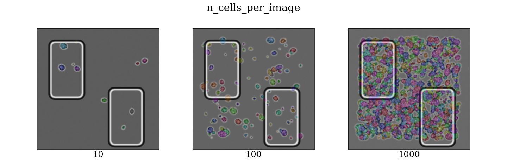
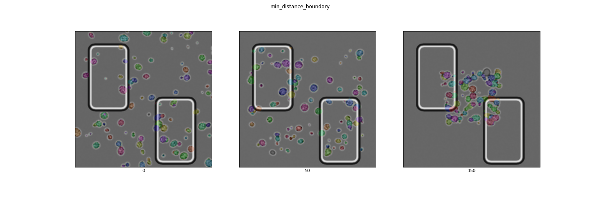
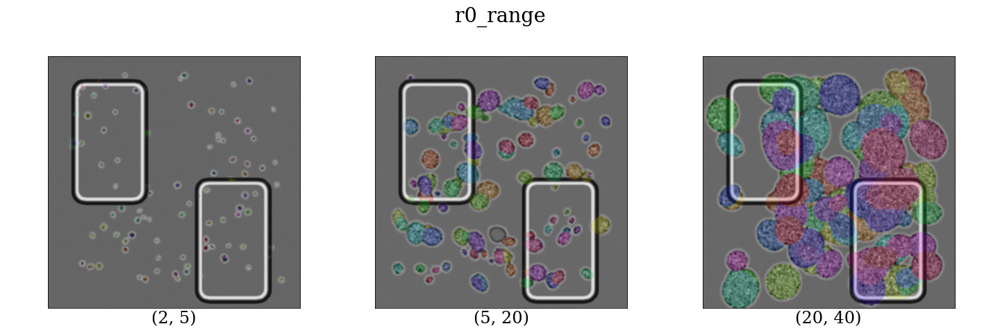
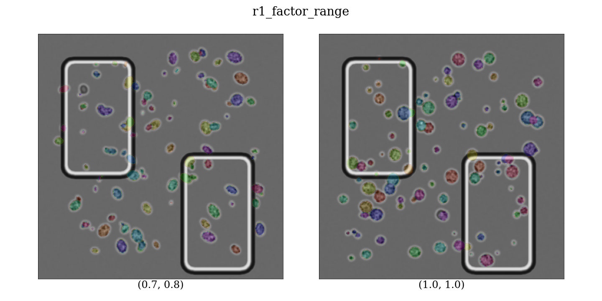
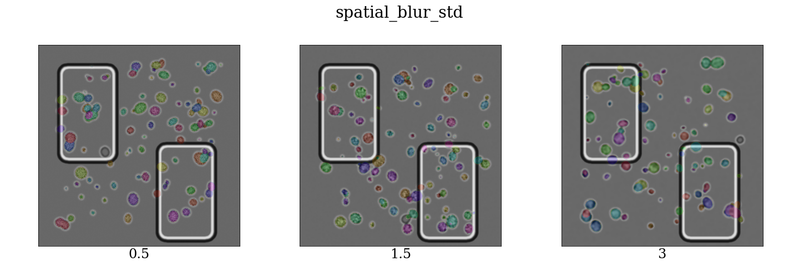
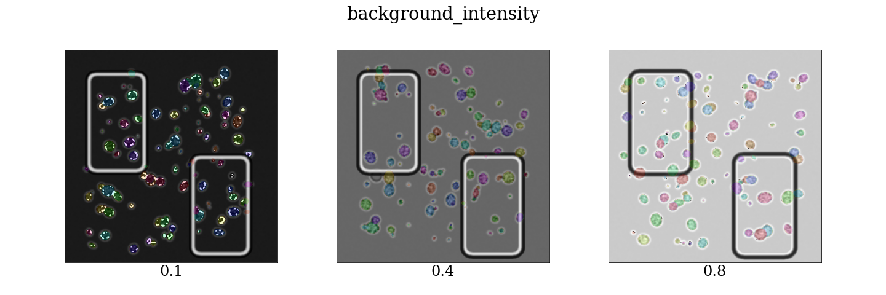
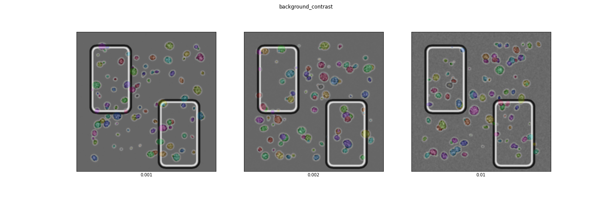
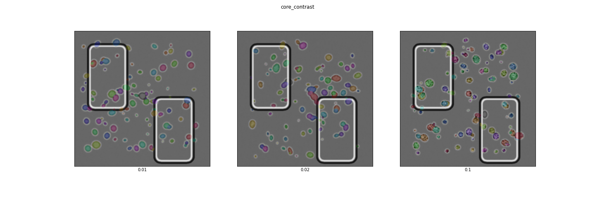
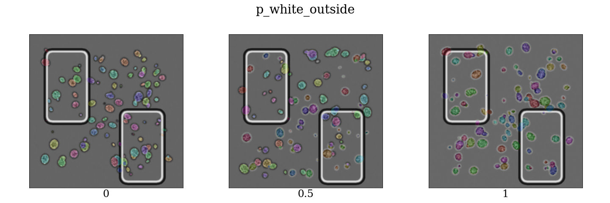

# Installation

# Usage

## Minimal example

A minimal run to create synthetic brightfield images of
yeast cells is by only specifying how many samples should
be generated. The other parameters are considered at their
defaults.

    from syntheticyeastcells import create_samples

    images, labels = create_samples(100)

## Example with all parameters

Alternatively you can specify these parameters to tweak
the properties of the images. This example shows the
default values

    images, labels = create_samples(
      # number of samples to create:
      n_images=len(axes),

      # number of cells per image
      n_cells_per_image=100,

      # image dimensions (height, width)
      size=(512, 512),

      # area at the boundary to not have cells
      min_distance_boundary=50,

      # range for the first radius of the ellipse as
      # an approximate of a cell, from which is sampled
      # uniformly
      r0_range=(2, 14),

      # range for the second radius of the ellipse as
      # an approximate of a cell as a factor of the first
      # radius, from which is sampled uniformly.
      r1_factor_range=(0.7, 1.3),

      # the background consists of gaussian noise, blurred by this
      # standard deviation.
      spatial_blur_std=1.5,

      # expected background greyscale, assuming a [0, 1] range
      background_intensity=0.4,

      # standard deviation of the noise outside of cells
      background_contrast=0.00188,

      # standard deviation of the noise inside cells
      core_contrast=0.0282,

      # probability the outside of a cell is white, and the
      # inside is white, instead of the other way around.
      p_white_outside=0.5
    )

## Example outputs for all parameters

## Output

`images` is a $n_images \times height \times width \times 3$ greyscale stack of images encoded as uint8,
and `labels` is a $n_images \times height \times width$ stack of labels encoded as uint32. Each cell
is encoded as a different integer and the background is encoded as `0`.

    from matplotlib import pyplot

    axes = pyplot.subplots(3, 3, figsize=(30, 30))[1].ravel()

    # Change the labels to rgba colors
    colors = pyplot.get_cmap('hsv')(numpy.linspace(0, 1, labels.max() + 1))
    colors[0] = [0, 0, 0, 0] # background is fully transparent.
    colors[1:, 3] = 0.2
    colors = (colors[labels] * 255).astype(numpy.uint8)

    for axis, image, label in zip(axes, images, colors):
      axis.imshow(image)
      axis.imshow(label)

## Create a dataset suitable for detectron2

    from syntheticyeastcells.detectron2 import create_dataset

    synthetic_data_folder = (
      '/slow-data/p253591/yeast cells/data/synthetic/v7')

    create_dataset(
      # Where to store the data set
      synthetic_data_folder,

      # sizesof several subsets
      sets={'test': 1000, 'val': 1000, 'train': 20000},
      
      # same parameters as before
      n_cells_per_image=100,
      size=(512, 512),
      min_distance_boundary=50,
      r0_range=(2, 14),
      r1_factor_range=(0.7, 1.3),
      spatial_blur_std=1.5,
      background_intensity=0.4,
      background_contrast=0.00188,
      core_contrast=0.0752,
      p_white_outside=0.5,

      # number of processes to run in parallel, number of samples created in one batch
      njobs=40, batch_size=1,

      # show a progressbar
      progressbar=True)

    with open(f'{synthetic_data_folder}/labels.json', 'w') as f:
      json.dump(labels, f)

This results in these files:

    ls '{synthetic_data_folder}/'*    
    /slow-data/p253591/yeast cells/data/synthetic/v8/labels.json

    /slow-data/p253591/yeast cells/data/synthetic/v8/test:
    image-0.jpg  image-1.jpg  image-2.jpg

    /slow-data/p253591/yeast cells/data/synthetic/v8/train:
    image-0.jpg  image-2.jpg  image-4.jpg  image-6.jpg  image-8.jpg
    image-1.jpg  image-3.jpg  image-5.jpg  image-7.jpg  image-9.jpg

    /slow-data/p253591/yeast cells/data/synthetic/v8/val:
    image-0.jpg  image-1.jpg  image-2.jpg
    
    
    cat '{synthetic_data_folder}/labels.json'
    {"test": [{"height": 512, "width": 512, "annotations": [{"bbox": [421.5, 139.5, 434.5, 154.5], "bbox_mode": 0, "segmentation": [[ ... ]], "category_id": 0, "iscrowd": 0}, ...., "valid": ...., "train": ...}
